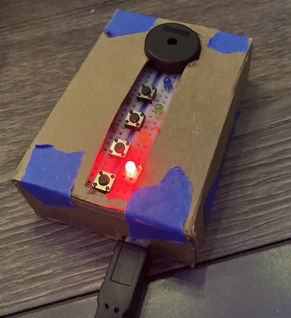
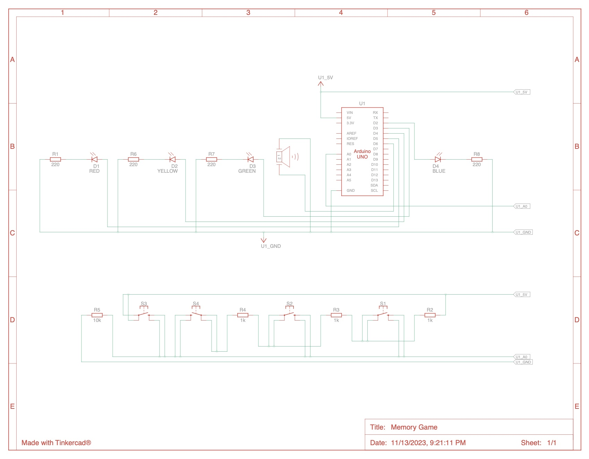
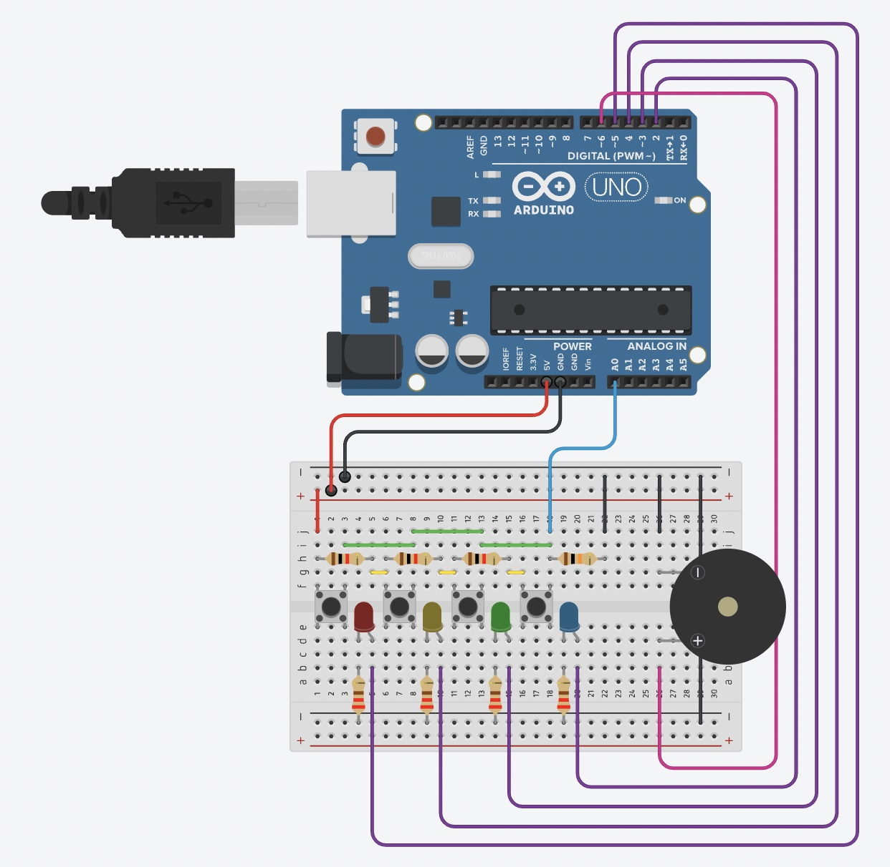
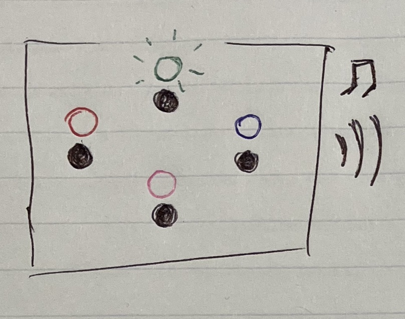
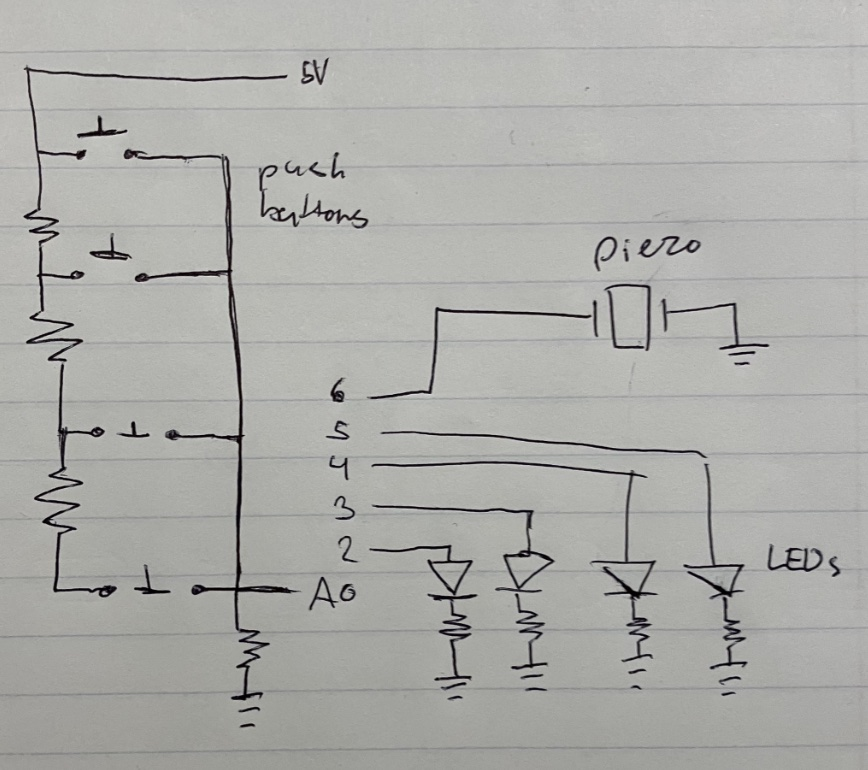
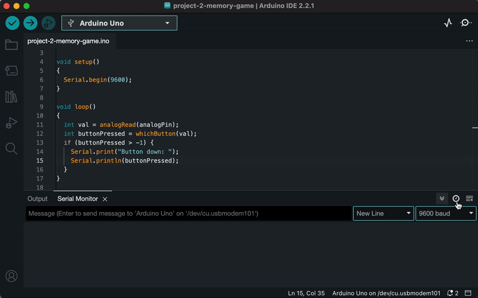
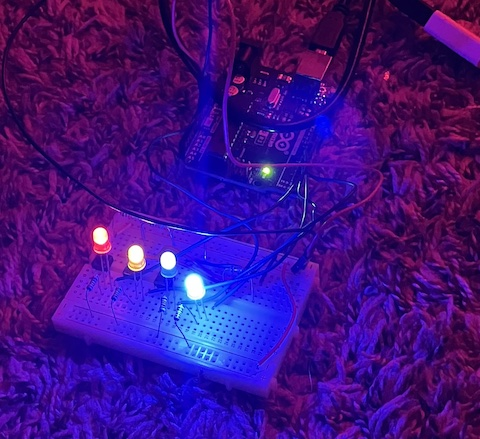
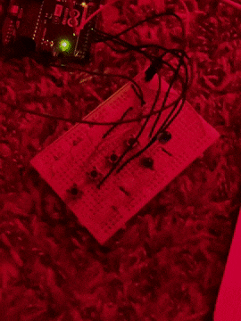
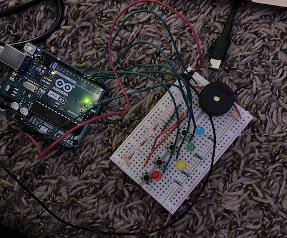
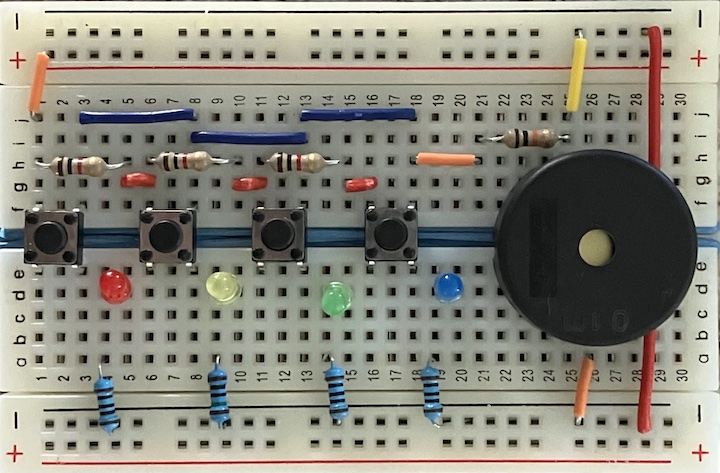

# arduino-memory-game

Memory game made for the Arduino.\

When I was a kid I used to see a lot of variants of the same memory game. The gameplay is simple: display a pattern that grows longer every turn, have the player repeat back the pattern until they get it wrong.

For my second project, I made my own circuit to play it. 

## Gameplay
The game starts up after a short light sequence when you power the arduino. Each turn, the game will display the pattern using the LEDs and piezo, then the player will repeat back the pattern using the push buttons.\

## Circuit
The electronics are pretty simple. The buttons connect to a resistor ladder to notify the program when each one is pressed. The arduino outputs to each of the LEDs and a piezo buzzer.\

## Software
I've divided the software into several components:
- [ButtonHandler](src/ButtonHandler.h): Tracks button presses
- [LightController](src/LightController.h): Turns the LEDs on and off
- [HardCodedFlashes](src/HardCodedFlashes.h): The game start and end light/sound sequences
- [MemoryGame](src/MemoryGame.h): The internal logic for playing the game

## Project Process
### Planning
I started by drawing up my initial sketches of what I wanted the final product to look like and my expectation for the schematic:\

### Building
After designing my board in Tinkercad and making sure I wasn't going to blow out any LEDs, I started working on the actual circuit.

First I got the buttons wired up with the resistor ladder.\

Then I got all the LEDs hooked up to the Arduino:\

Connecting the buttons to their respective lights:\

### Coding
Once I made sure all the buttons and lights would work, I got started on the game logic. I wanted to make sure the game logic didn't rely on the Arduino core libraries so that it would be more reusable and easier to test. The resulting code and a PTUI example can be found [here](https://github.com/maffiemaffie/memory-game-core).

### Finishing the circuit
Finally, I added the piezo and connected all of my Arduino functions to the game logic. The circuit at this point can be seen here:\

### Cleaning up the design
Once I had the game fully working, I reorganized the wiring, and trimmed the leads on my components.\

After a few tweaks, I finalized my tinkercad mockup and my breadboard and constructed a box to contain all of the circuitry.\

